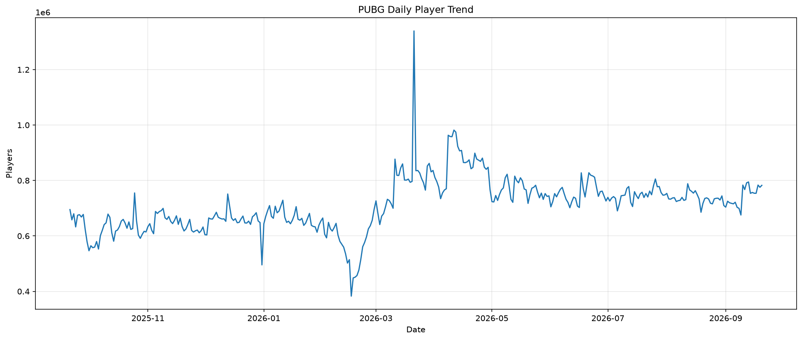
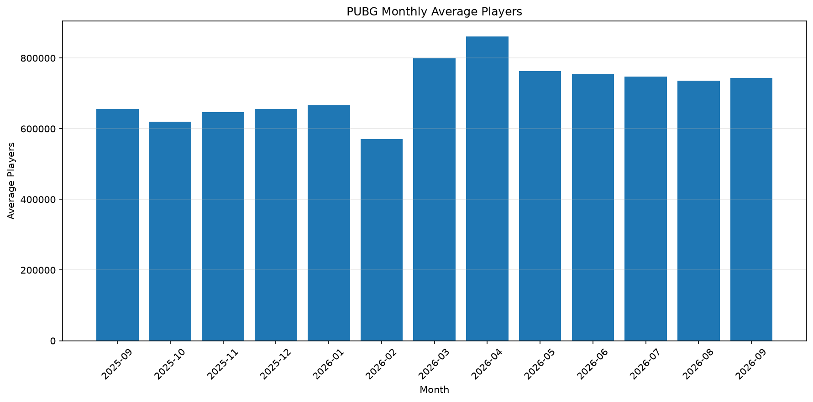
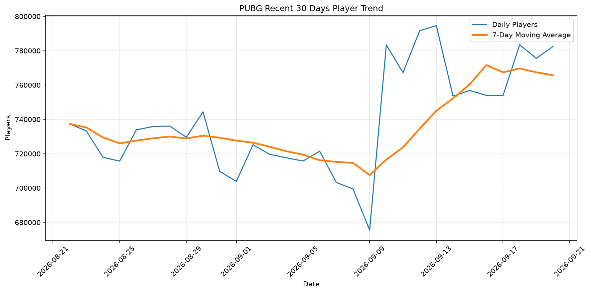
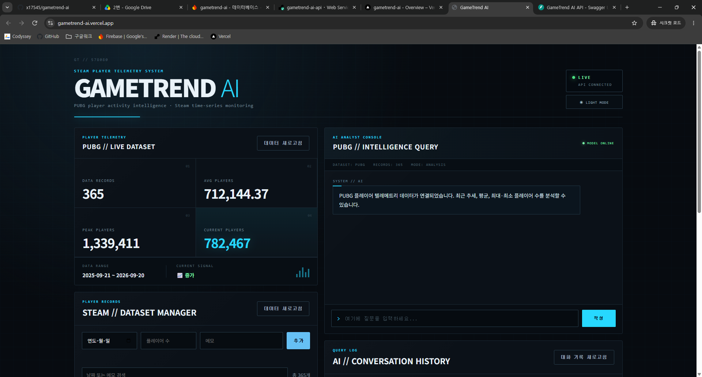
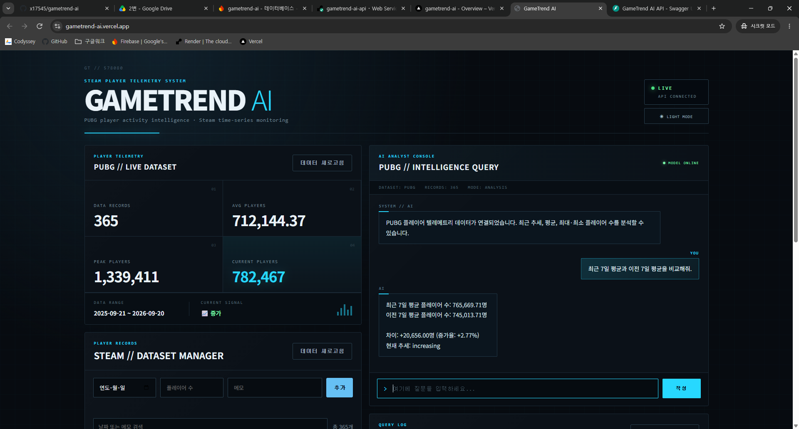
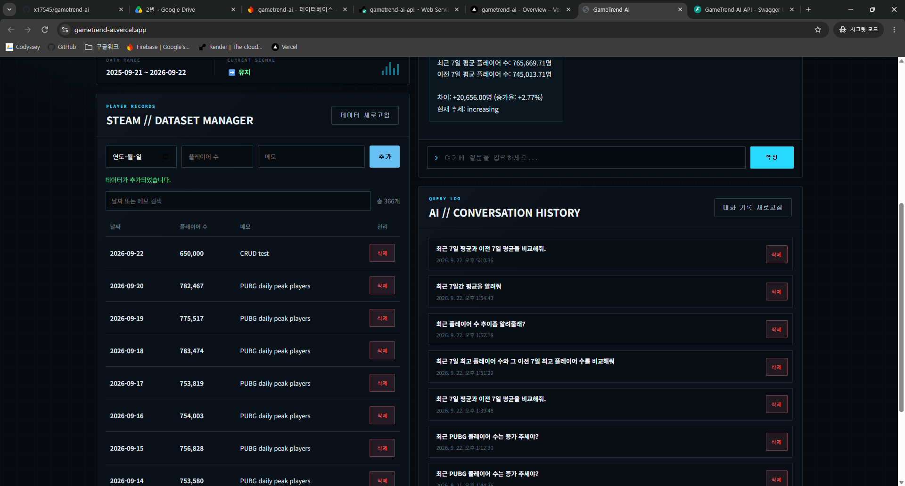
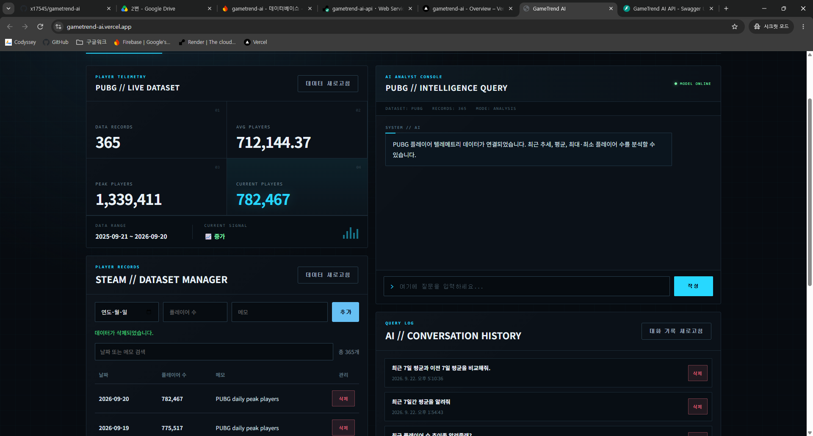
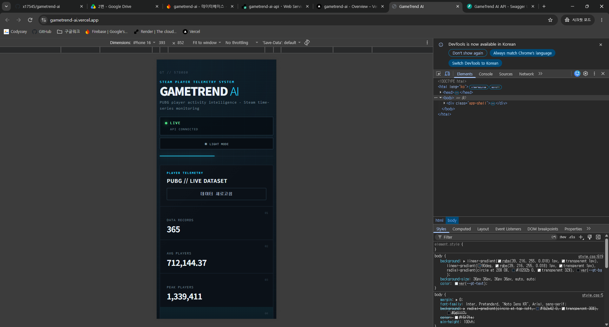
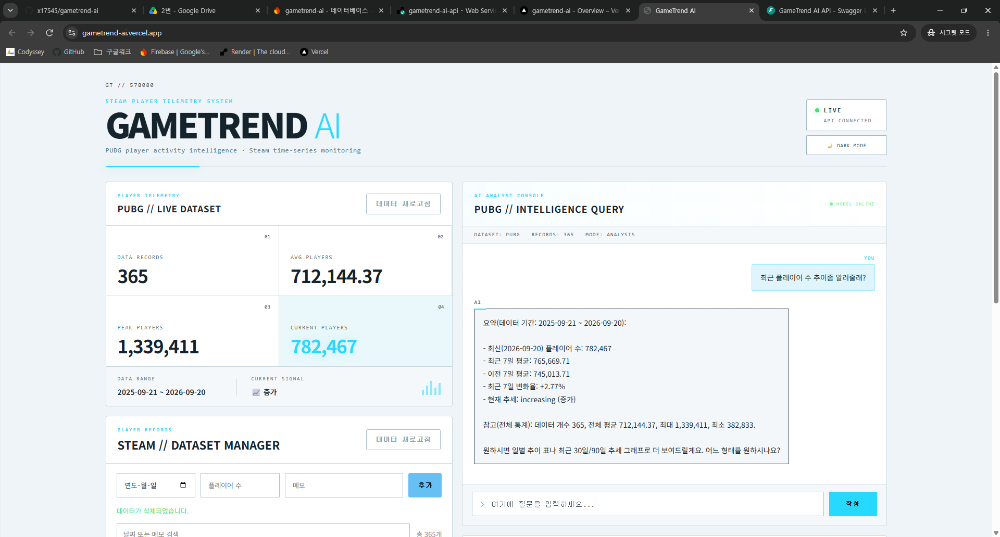

# GameTrend AI

Steam PUBG 플레이어 데이터를 분석하고, AI에게 데이터 기반 질문을 할 수 있는 웹 애플리케이션입니다.

플레이어 수의 장기 추세와 최근 변화, 월별 평균 등을 분석하고 FastAPI + Firebase Firestore + AI API를 이용하여 데이터 기반 질의 기능을 구현했습니다.

---

## 주요 기능

### 1. PUBG 플레이어 데이터 요약

- 전체 데이터 개수
- 평균 플레이어 수
- 최대 플레이어 수
- 최근 플레이어 수
- 데이터 기간
- 최근 추세 표시

### 2. AI 데이터 분석 채팅

- 실제 플레이어 데이터 요약값을 AI 컨텍스트로 전달
- 최근 추세 분석
- 최근 7일 평균과 이전 7일 평균 비교
- 평균 / 최대 / 최소 플레이어 수 질의

예시 질문:

```text
최근 PUBG 플레이어 수는 증가 추세야?
```

```text
최근 7일 평균과 이전 7일 평균을 비교해줘.
```

```text
전체 평균 플레이어 수와 최대 플레이어 수를 알려줘.
```
### 3. 데이터 CRUD

- 플레이어 데이터 추가
- 데이터 조회
- 데이터 수정
- 데이터 삭제

### 4. 대화 기록 관리

- AI 대화 저장
- 대화 기록 목록 조회
- 저장된 대화 불러오기
- 대화 기록 삭제

### 5. 반응형 UI

- PC / 모바일 대응
- Light Mode / Dark Mode 지원

## 데이터 분석

분석 데이터는 SteamDB의 PUBG 플레이어 데이터를 기반으로 전처리했습니다.

- PUBG Steam App ID: 578080
- 데이터 개수: 365
- 분석 기간: 2025-09-21 ~ 2026-09-20
- 평균 플레이어 수: 712,144.37
- 최대 플레이어 수: 1,339,411
- 최소 플레이어 수: 382,833
- 최근 플레이어 수: 782,467

최근 7일 평균 플레이어 수는 약 765,669.71이며, 이전 7일 평균 약 745,013.71과 비교했을 때 약 2.77% 증가했습니다.

자세한 분석 내용은 아래 리포트에서 확인할 수 있습니다.

```text
REPORT.md
```


## 시각화

### 전체 기간 플레이어 수 추세



### 월별 평균 플레이어 수



### 최근 30일 플레이어 수와 7일 이동평균




## 프로젝트 화면

### 메인 대시보드



### AI 분석 채팅



### 데이터 CRUD



### 대화 기록



### 모바일 반응형



### 라이트 모드




## 보너스 기능

### 1. 프론트 데이터 시각화

최근 30일 PUBG 플레이어 데이터를 웹 대시보드에서 선 그래프로 시각화하였다.

- 데이터 API에서 최근 30일 데이터를 조회
- Chart.js를 이용해 플레이어 수 변화 추세 표시
- PC / 모바일 반응형 지원
- Dark / Light Mode와 함께 사용 가능

### 2. 데이터 내보내기

데이터 관리 화면에서 현재 저장된 플레이어 데이터를 CSV 파일로 다운로드할 수 있다.

다운로드 파일:

```text
gametrend_data.csv
```

CSV 컬럼:
```text
date,value,memo
```

### 3. 확장 통계

데이터 요약 API에서는 기본 통계 외에도 다음 지표를 제공한다.

- 최근 7일 평균
- 이전 7일 평균
- 변화율
- 현재 추세

이를 AI 컨텍스트와 대시보드 분석에 활용한다.

### 4. Dark / Light Mode

사용자가 화면 테마를 직접 전환할 수 있으며, 선택한 테마는 브라우저에 저장되어 다음 접속 시에도 유지된다.


## 기술 스택

**Frontend**

- HTML
- CSS
- JavaScript
- Vercel

**Backend**

- Python
- FastAPI
- Uvicorn
- OpenAI Python SDK
- Render

**Database**

- Firebase Firestore

**Data Analysis**

- Python
- CSV
- Matplotlib

**AI**

- OpenAI Compatible API
- GPT-5-mini


## 프로젝트 구조

```text
gametrend-ai/
├─ backend/
│  ├─ app/
│  ├─ requirements.txt
│  └─ .env.example
│
├─ data/
│  └─ steam_players.csv
│
├─ frontend/
│  ├─ css/
│  │  └─ style.css
│  ├─ js/
│  │  ├─ api.js
│  │  ├─ chat.js
│  │  ├─ conversations.js
│  │  ├─ data.js
│  │  └─ theme.js
│  └─ index.html
│
├─ reports/
│  ├─ player_trend.png
│  ├─ monthly_average.png
│  └─ recent_30d_moving_average.png
│
├─ scripts/
│  ├─ create_charts.py
│  ├─ prepare_steam_data.py
│  └─ seed_firestore.py
│
├─ REPORT.md
├─ README.md
└─ .gitignore
```


## 데이터 전처리

원본 SteamDB 데이터를 분석용 데이터로 변환합니다.

```powershell
python scripts/prepare_steam_data.py
```

전처리된 데이터는 다음 위치에 저장됩니다.

```text
data/steam_players.csv
```


## 시각화 생성

분석 그래프를 생성하려면 다음 명령어를 실행합니다.

```powershell
python scripts/create_charts.py
```

생성되는 그래프:

```text
reports/player_trend.png
reports/monthly_average.png
reports/recent_30d_moving_average.png
```


## 로컬 실행 방법

### 1. 가상환경 생성

```powershell
python -m venv .venv
```

### 2. 가상환경 활성화
Windows PowerShell:

```powershell
.venv\Scripts\Activate.ps1
```

### 3. 백엔드 패키지 설치

```powershell
pip install -r backend/requirements.txt
```

### 4. 환경 변수 설정

backend/.env.example을 참고하여 환경 변수를 설정합니다.
예시:

```env
OPENAI_API_KEY=your_api_key
OPENAI_BASE_URL=https://copa.codyssey.kr/v1
OPENAI_MODEL=gpt-5-mini
```

Firebase 서비스 계정 정보도 별도로 설정해야 합니다.
실제 API Key와 Firebase 인증 정보는 GitHub에 업로드하지 않습니다.

### 5. FastAPI 서버 실행

backend 폴더로 이동합니다.

```powershell
cd backend
```

서버를 실행합니다.

```powershell
uvicorn app.main:app --reload
```


### 6. Swagger 확인

```text
http://127.0.0.1:8000/docs
```

### 7. 프론트엔드 실행

VS Code Live Server 등을 사용하여:

```text
frontend/index.html
```

을 실행합니다.


## 배포 주소

**Frontend**

https://gametrend-ai.vercel.app

**Backend API**

https://gametrend-ai-api.onrender.com

**Swagger API Documentation**

https://gametrend-ai-api.onrender.com/docs

Render 무료 서비스는 일정 시간 요청이 없을 경우 서버가 절전 상태가 될 수 있어 첫 요청에 시간이 걸릴 수 있습니다.

## API 주요 엔드포인트

**Data**

```text
POST   /api/data
GET    /api/data
PUT    /api/data/{id}
DELETE /api/data/{id}
GET    /api/data/summary
```

**Conversations**

```text
POST   /api/conversations
GET    /api/conversations
GET    /api/conversations/{id}
DELETE /api/conversations/{id}
```

**AI Chat**

```text
POST /api/chat
```


## AI 분석 방식

백엔드는 Firestore에 저장된 플레이어 데이터를 기반으로 요약 정보를 생성합니다.
AI에게는 전체 365개의 데이터를 그대로 전달하는 대신 다음과 같은 분석 요약 정보를 컨텍스트로 제공합니다.

- 전체 데이터 개수
- 데이터 기간
- 평균 플레이어 수
- 최대 / 최소 플레이어 수
- 최근 플레이어 수
- 최근 7일 평균
- 이전 7일 평균
- 변화율
- 현재 추세

따라서 전체적인 추세 분석에는 적합하지만, 임의의 특정 날짜 플레이어 수와 같은 질문은 현재 구조에서 제한될 수 있습니다.


## 분석 리포트

자세한 시계열 데이터 분석 결과는 다음 파일에서 확인할 수 있습니다.

```text
REPORT.md
```

리포트에는 다음 내용이 포함되어 있습니다.

- 분석 주제
- 분석 질문
- 데이터 설명
- 데이터 전처리
- 시각화 3개
- 주요 인사이트
- AI 분석 기능
- 결론
- 한계점


## 프로젝트 목적

본 프로젝트는 시계열 데이터를 직접 수집 및 전처리하고, 시각화와 AI 분석 기능을 웹 애플리케이션으로 연결하는 것을 목표로 합니다.
단순한 데이터 조회를 넘어 사용자가 자연어로 플레이어 데이터의 흐름을 질문하고 분석 결과를 확인할 수 있도록 구현했습니다.