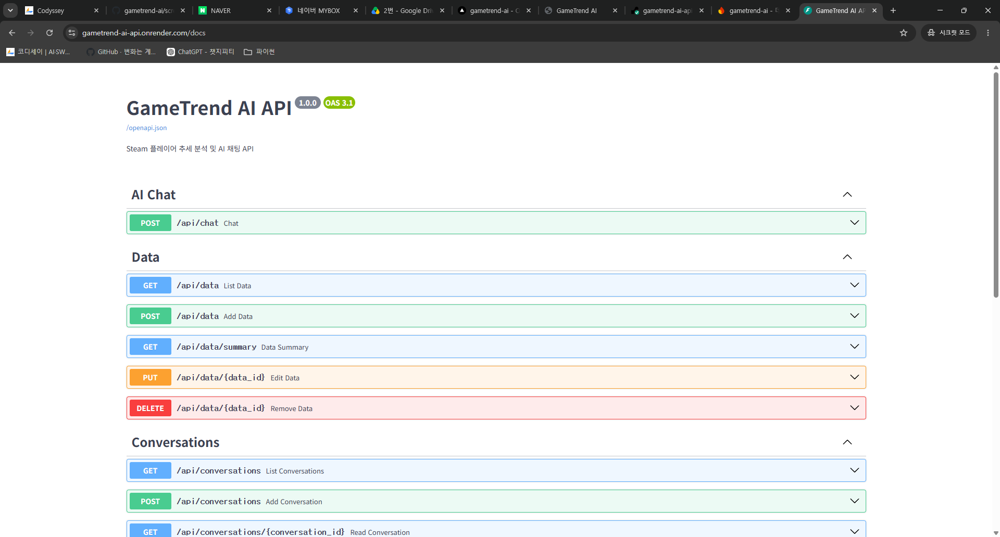

# GameTrend AI

Steam PUBG 플레이어 데이터를 분석하고, AI에게 데이터 기반 질문을 할 수 있는 웹 애플리케이션입니다.

플레이어 수의 장기 추세와 최근 변화, 월별 평균 등을 분석하고 FastAPI + Firebase Firestore + AI API를 이용하여 데이터 기반 질의 기능을 구현했습니다.

---

## 주요 기능

### 1. PUBG 플레이어 데이터 요약

- 전체 데이터 개수
- 평균 플레이어 수
- 최대 플레이어 수
- 최근 플레이어 수
- 데이터 기간
- 최근 추세 표시

### 2. AI 데이터 분석 채팅

- 실제 플레이어 데이터 요약값을 AI 컨텍스트로 전달
- 최근 추세 분석
- 최근 7일 평균과 이전 7일 평균 비교
- 평균 / 최대 / 최소 플레이어 수 질의

예시 질문:

```text
최근 PUBG 플레이어 수는 증가 추세야?
```

```text
최근 7일 평균과 이전 7일 평균을 비교해줘.
```

```text
전체 평균 플레이어 수와 최대 플레이어 수를 알려줘.
```
### 3. 데이터 CRUD

- 플레이어 데이터 추가
- 데이터 조회
- 데이터 수정
- 데이터 삭제

### 4. 대화 기록 관리

- AI 대화 저장
- 대화 기록 목록 조회
- 저장된 대화 불러오기
- 대화 기록 삭제

### 5. 반응형 UI

- PC / 모바일 대응
- Light Mode / Dark Mode 지원

## 데이터 분석

분석 데이터는 SteamDB의 PUBG 플레이어 데이터를 기반으로 전처리했습니다.

- PUBG Steam App ID: 578080
- 데이터 개수: 365
- 분석 기간: 2025-09-21 ~ 2026-09-20
- 평균 플레이어 수: 712,144.37
- 최대 플레이어 수: 1,339,411
- 최소 플레이어 수: 382,833
- 최근 플레이어 수: 782,467

최근 7일 평균 플레이어 수는 약 765,669.71이며, 이전 7일 평균 약 745,013.71과 비교했을 때 약 2.77% 증가했습니다.

자세한 분석 내용은 아래 리포트에서 확인할 수 있습니다.

```text
REPORT.md
```


## 시각화

### 전체 기간 플레이어 수 추세


### 월별 평균 플레이어 수


### 최근 30일 플레이어 수와 7일 이동평균


## 프로젝트 화면

### 메인 대시보드


### AI 분석 채팅


### 데이터 CRUD


### 대화 기록


### 모바일 반응형 구현

`frontend/index.html`에는 모바일 화면 대응을 위한 viewport 설정이 적용되어 있습니다.

```html
<meta name="viewport" content="width=device-width, initial-scale=1.0">
```

또한 frontend/css/style.css에서는 @media 미디어 쿼리를 사용하여
좁은 화면에서 카드, 버튼, 그래프, 데이터 영역이 화면 너비에 맞게 재배치되도록 구현했습니다.
모바일 환경에서 다음 항목을 확인했습니다.
- 카드 영역 세로 재배치
- 버튼 너비 조정
- 그래프 영역 축소
- 텍스트 줄바꿈
- 데이터 영역 가독성 유지


### 라이트 모드


## 보너스 기능

### 1. 프론트 데이터 시각화

최근 30일 PUBG 플레이어 데이터를 웹 대시보드에서 선 그래프로 시각화하였다.

- 데이터 API에서 최근 30일 데이터를 조회
- Chart.js를 이용해 플레이어 수 변화 추세 표시
- PC / 모바일 반응형 지원
- Dark / Light Mode와 함께 사용 가능

### 2. 데이터 내보내기

데이터 관리 화면에서 현재 저장된 플레이어 데이터를 CSV 파일로 다운로드할 수 있다.

다운로드 파일:

```text
gametrend_data.csv
```

CSV 컬럼:
```text
date,value,memo
```

### 3. 확장 통계

데이터 요약 API에서는 기본 통계 외에도 다음 지표를 제공한다.

- 최근 7일 평균
- 이전 7일 평균
- 변화율
- 현재 추세

이를 AI 컨텍스트와 대시보드 분석에 활용한다.

### 4. Dark / Light Mode

사용자가 화면 테마를 직접 전환할 수 있으며, 선택한 테마는 브라우저에 저장되어 다음 접속 시에도 유지된다.

### 5. Function Calling 기반 데이터 조회

GameTrend AI의 AI 채팅은 사용자의 질문 내용에 따라 필요한 내부 도구를 자동으로 선택해 호출할 수 있도록 Function Calling을 적용하였다.

현재 등록된 주요 도구는 다음과 같다.

- `get_data_summary`
  - 저장된 PUBG 플레이어 데이터의 요약 통계를 조회한다.
  - 데이터 개수, 기간, 평균, 최대/최소, 최근 값, 최근 7일 평균, 이전 7일 평균, 변화율, 추세 등을 반환한다.

- `get_conversations`
  - 저장된 AI 대화 기록 목록을 조회한다.
  - 최근 대화 제목, 메시지, 생성 시각 등을 확인할 때 사용한다.

채팅 요청마다 최신 플레이어 데이터 요약을 시스템 프롬프트에 직접 포함한다.
AI는 주입된 요약으로 답변하고, 요약 재조회나 대화 기록 조회가 필요한 경우
관련 도구를 호출하여 결과를 바탕으로 최종 답변을 생성한다.

예시:

```text
사용자
  ↓
"최근 7일 평균과 이전 7일 평균을 비교해줘"
  ↓
최신 요약을 시스템 프롬프트에 직접 포함
  ↓
필요시 AI가 get_data_summary 호출 결정
  ↓
FastAPI Service에서 실제 저장 데이터 조회
  ↓
도구 실행 결과 반환
  ↓
AI가 실제 데이터 기반 최종 답변 생성
```

### 6. MCP Server 연동

GameTrend AI는 Model Context Protocol(MCP) Server를 추가하여
기존 데이터 조회 기능을 MCP Tool 형태로 외부 클라이언트에서도 사용할 수 있도록 구성하였다.
현재 MCP Server에 등록된 도구는 다음과 같다.
- get_player_data_summary
- get_saved_conversations
MCP Tool은 별도의 데이터 처리 로직을 새로 구현하지 않고
기존 FastAPI Service Layer를 그대로 재사용한다.

```text
MCP Client / MCP Inspector
        ↓
GameTrend AI MCP Server
        ↓
get_player_data_summary
get_saved_conversations
        ↓
기존 Service Layer
        ↓
Firestore / 저장 데이터
```

MCP Inspector를 이용하여 다음 항목을 확인하였다.
- MCP Server 연결
- Tool 목록 조회
- get_player_data_summary 실행
- get_saved_conversations 실행
- 실제 저장 데이터 반환 확인

#### MCP 실행 확인

MCP Inspector에서 GameTrend AI MCP Server가 정상 연결되고
등록된 Tool 목록을 확인한 화면이다.


`get_player_data_summary` Tool을 실행하여 실제 PUBG 플레이어 요약 통계를 조회한 결과이다.


`get_saved_conversations` Tool을 실행하여 Firestore에 저장된 대화 기록을 조회한 결과이다.


### 7. Tool 호출이 필요한 이유

AI가 전체 원시 데이터를 항상 시스템 프롬프트에 미리 포함하면
불필요한 토큰 사용량이 늘어나고 최신 데이터 반영에도 불리할 수 있다.
Function Calling과 MCP Tool을 사용하면
사용자의 질문에 필요한 경우에만 실제 저장 데이터를 조회할 수 있다.
이를 통해 다음과 같은 장점을 얻을 수 있다.
- 필요한 시점에 실제 데이터 조회
- 데이터 변경 시 최신 값 반영
- 프롬프트 크기 감소
- AI와 서비스 로직 분리
- 외부 MCP 클라이언트에서도 동일 기능 재사용 가능

#### 기존 컨텍스트 주입 방식의 장단점

초기 구현에서는 데이터 요약값을 시스템 프롬프트에 직접 포함하여 AI에게 전달하였습니다.

이 방식은 구현이 단순하고, 한 번의 요청만으로 AI가 바로 데이터를 참고할 수 있다는 장점이 있습니다.

하지만 다음과 같은 한계가 있습니다.

- 질문과 관계없는 데이터까지 항상 프롬프트에 포함될 수 있습니다.
- 데이터가 많아질수록 토큰 사용량이 증가할 수 있습니다.
- 데이터가 변경되었을 때 최신 값을 다시 반영하는 구조가 복잡해질 수 있습니다.
- AI가 실제 데이터 조회와 답변 생성을 한 번에 처리하게 되어 역할 분리가 약해질 수 있습니다.

현재는 기본 요구사항을 충족하기 위해 요약의 시스템 프롬프트 직접 주입을 유지하고,
추가 조회에는 Function Calling을 함께 사용하도록 구성하였습니다.

이 방식은 필요한 시점에 최신 데이터를 조회할 수 있고,
AI 응답 로직과 데이터 조회 로직을 분리할 수 있다는 장점이 있습니다.

다만 매 채팅 요청마다 요약 조회와 프롬프트 토큰 비용이 발생하며,
Tool 호출이 추가되면 요청 처리 단계도 늘어납니다. 또한
도구 호출 실패나 외부 서비스 오류를 함께 고려해야 한다는 점은 추가적인 운영 리스크가 될 수 있습니다.

## 기술 스택

**Frontend**

- HTML
- CSS
- JavaScript
- Vercel

**Backend**

- Python
- FastAPI
- Uvicorn
- OpenAI Python SDK
- Render

**Database**

- Firebase Firestore

**Data Analysis**

- Python
- CSV
- Matplotlib

**AI**

- OpenAI Compatible API
- GPT-5-mini

## Firestore 데이터 구조

Firestore에서는 시계열 플레이어 데이터와 AI 대화 기록을 서로 다른 컬렉션으로 분리하여 저장하였습니다.

### Firestore 컬렉션 분리 설계 이유

Firestore에서는 시계열 데이터와 대화 기록을 서로 다른 컬렉션으로 분리했습니다.

- `data`
  - 날짜별 PUBG 플레이어 수 저장
  - 시계열 분석, CRUD, 통계 계산에 사용

- `conversations`
  - AI 대화 제목, 메시지, 생성 시각 저장
  - 대화 기록 조회, 불러오기, 삭제에 사용

두 컬렉션을 분리한 이유는 데이터의 목적과 조회 패턴이 서로 다르기 때문입니다.

`data` 컬렉션은 날짜 기준 정렬과 통계 계산이 중심이고,
`conversations` 컬렉션은 생성 시각 기준 정렬과 대화 단위 조회가 중심입니다.

따라서 컬렉션을 분리하면 다음 장점이 있습니다.

- 데이터 역할이 명확해짐
- 서로 다른 조회 패턴 관리가 쉬움
- 불필요한 혼합 쿼리 방지
- 서비스 로직 분리
- 유지보수 용이성 향상

### 대화 저장 방식

AI 대화는 사용자의 질문과 AI의 답변이 생성된 후 하나의 대화 기록으로 저장합니다.

Firestore의 `conversations` 컬렉션에는 다음 정보를 저장합니다.

- `title`
  - 대화 목록에서 내용을 빠르게 구분하기 위한 제목입니다.
- `messages`
  - 사용자와 AI의 메시지를 순서대로 저장합니다.
- `created_at`
  - 대화가 생성된 시점을 기록합니다.

이 구조를 선택한 이유는 하나의 대화 문서 안에서
대화 제목과 메시지 흐름을 함께 관리할 수 있고,
특정 대화를 다시 불러올 때 필요한 데이터를 한 번에 조회할 수 있기 때문입니다.

또한 대화 목록에서는 `created_at`을 기준으로 최신 대화부터 정렬하여
사용자가 최근 기록을 쉽게 확인할 수 있도록 구성하였습니다.


## 프로젝트 구조

```text
gametrend-ai/
├─ backend/
│  ├─ app/
│  ├─ requirements.txt
│  └─ .env.example
│
├─ data/
│  └─ steam_players.csv
│
├─ frontend/
│  ├─ css/
│  │  └─ style.css
│  ├─ js/
│  │  ├─ api.js
│  │  ├─ chat.js
│  │  ├─ conversations.js
│  │  ├─ data.js
│  │  └─ theme.js
│  └─ index.html
│
├─ reports/
│  ├─ player_trend.png
│  ├─ monthly_average.png
│  └─ recent_30d_moving_average.png
│
├─ scripts/
│  ├─ create_charts.py
│  ├─ prepare_steam_data.py
│  └─ seed_firestore.py
│
├─ REPORT.md
├─ README.md
└─ .gitignore
```


## 데이터 전처리

원본 SteamDB 데이터를 분석용 데이터로 변환합니다.

```powershell
python scripts/prepare_steam_data.py
```

전처리된 데이터는 다음 위치에 저장됩니다.

```text
data/steam_players.csv
```


## 시각화 생성

분석 그래프를 생성하려면 다음 명령어를 실행합니다.

```powershell
python scripts/create_charts.py
```

생성되는 그래프:

```text
reports/player_trend.png
reports/monthly_average.png
reports/recent_30d_moving_average.png
```


## 로컬 실행 방법

### 1. 가상환경 생성

```powershell
python -m venv .venv
```

### 2. 가상환경 활성화
Windows PowerShell:

```powershell
.venv\Scripts\Activate.ps1
```

### 3. 백엔드 패키지 설치

```powershell
pip install -r backend/requirements.txt
```

### 4. 환경 변수 설정

`backend/.env.example`을 참고하여 환경 변수를 설정합니다.

백엔드 예시:

```env
OPENAI_API_KEY=your_api_key
OPENAI_BASE_URL=https://copa.codyssey.kr/v1
OPENAI_MODEL=gpt-5-mini
FIREBASE_SERVICE_ACCOUNT_JSON=your_firebase_service_account_json
ALLOWED_ORIGINS=https://gametrend-ai.vercel.app
```

프론트엔드 배포 환경 변수 예시:

```env
API_BASE_URL=https://gametrend-ai-api.onrender.com
```

실제 API Key와 Firebase 인증 정보는 GitHub에 업로드하지 않습니다.

### 5. FastAPI 서버 실행

backend 폴더로 이동합니다.

```powershell
cd backend
```

서버를 실행합니다.

```powershell
uvicorn app.main:app --reload
```


### 6. Swagger 확인

```text
http://127.0.0.1:8000/docs
```

### 7. 프론트엔드 실행

VS Code Live Server 등을 사용하여:

```text
frontend/index.html
```

을 실행합니다.


## 배포 주소

### 실제 서비스 접속 경로

사용자는 아래 Vercel 프론트엔드 주소로 접속합니다.

- Frontend: https://gametrend-ai.vercel.app
- Backend API: https://gametrend-ai-api.onrender.com
- Swagger Docs: https://gametrend-ai-api.onrender.com/docs

프론트엔드는 Render에 배포된 FastAPI 백엔드와 통신하며,
실제 사용자는 Vercel 프론트엔드 주소를 통해 서비스를 이용합니다.

### Swagger 배포 확인

Render에 배포된 FastAPI 서버에서 아래 주소로 Swagger UI가 정상 제공되는 것을 확인했습니다.

```text
https://gametrend-ai-api.onrender.com/docs
```

실제 배포 환경에서 Swagger UI가 열리고,
POST /api/chat, GET /api/data, GET /api/data/summary 등의 엔드포인트가
노출되는 것을 확인했습니다.



### Render Cold Start 대응

Render 무료 인스턴스는 일정 시간 요청이 없으면 절전 상태로 전환될 수 있어
첫 요청 응답이 지연될 수 있습니다.

현재 프로젝트에서는 다음 방식으로 대응하고 있습니다.

- 프론트엔드에서 로딩 상태 표시
- 첫 요청이 느릴 수 있음을 사용자에게 안내
- 요청 실패 시 재시도 안내
- 서비스 활성화 이후 정상적으로 기능을 계속 사용할 수 있도록 구성

향후에는 다음과 같은 방법으로 개선할 수 있습니다.

- 유료 인스턴스로 전환하여 절전 방지
- 별도 헬스체크 또는 주기적 요청 적용
- timeout 및 retry 로직 추가
- 초기 데이터 캐싱 적용

현재는 무료 배포 환경의 제약을 고려하여
사용자 안내와 로딩 UI 중심으로 대응하고 있습니다.

## API 주요 엔드포인트

**Data**

```text
POST   /api/data
GET    /api/data
PUT    /api/data/{id}
DELETE /api/data/{id}
GET    /api/data/summary
```

**Conversations**

```text
POST   /api/conversations
GET    /api/conversations
GET    /api/conversations/{id}
DELETE /api/conversations/{id}
```

**AI Chat**

```text
POST /api/chat
```

### 데이터 요약 API를 별도로 분리한 이유

`GET /api/data/summary`는 전체 원시 데이터를 전달하지 않고
AI 분석과 대시보드에 필요한 핵심 통계만 제공하기 위해 별도로 분리했습니다.

별도 요약 API를 사용한 이유는 다음과 같습니다.

- 전체 원시 데이터 전송량 감소
- 프론트엔드와 AI가 동일한 통계 로직 재사용
- 평균, 최대, 최소, 최근값, 7일 평균 등의 계산을 서버에서 일관되게 처리
- 통계 계산 로직 중복 방지
- 데이터가 변경되어도 같은 서비스 함수를 통해 최신 값 반영 가능
- 향후 요약 지표가 추가되어도 프론트와 AI 코드를 각각 수정할 필요가 줄어듦

실제 `get_data_summary()` 서비스 함수는
`GET /api/data/summary`와 AI 채팅에서 함께 재사용됩니다.

## AI 분석 방식

GameTrend AI의 AI 채팅은 매 요청마다 `get_data_summary()`로 최신 요약을 조회하고,
JSON으로 직렬화하여 첫 AI 요청의 `system` 메시지에 직접 포함합니다.
`GET /api/data/summary`와 동일한 서비스 함수를 재사용하므로 통계 계산 로직이 일치합니다.
요약 조회에 실패하면 AI 요청을 진행하지 않고 기존 채팅 오류 처리로 전달합니다.
데이터가 없거나 통계가 null인 경우에는 값을 추측하지 않도록 안내합니다.

기존 Function Calling도 유지하여 추가 조회에 활용합니다.

예를 들어 플레이어 수 요약, 최근 7일 평균, 이전 7일 평균,
변화율, 현재 추세 등이 필요한 질문에는
시스템 프롬프트에 포함된 요약을 우선 사용하고, 필요시 `get_data_summary` 도구로 다시 조회합니다.

대화 기록 관련 질문에는
`get_conversations` 도구를 호출하여 저장된 대화 목록을 조회합니다.

데이터 요약에는 다음 정보가 포함됩니다.

- 전체 데이터 개수
- 데이터 기간
- 평균 플레이어 수
- 최대 / 최소 플레이어 수
- 최근 플레이어 수
- 최근 7일 평균
- 이전 7일 평균
- 변화율
- 현재 추세

AI는 시스템 프롬프트의 요약과 도구에서 반환된 실제 데이터를 근거로 최종 답변을 생성하며,
저장된 데이터에 없는 내용은 추측하지 않도록 구성했습니다.

현재 요약 기반 도구는 전체적인 추세 분석에는 적합하지만,
임의의 특정 날짜 플레이어 수처럼 원시 데이터 단건 조회가 필요한 질문은
지원 범위가 제한될 수 있습니다.

### 시스템 프롬프트 직접 주입의 운영 고려사항

GameTrend AI는 평가 요구사항을 충족하기 위해
매 채팅 요청마다 `get_data_summary()`의 결과를 시스템 프롬프트에 직접 포함합니다.

장점:

- AI가 첫 요청부터 실제 데이터 요약을 확인 가능
- Function Calling 여부와 관계없이 기본 통계 기반 응답 가능
- 데이터 기반 답변의 일관성 향상
- 요약값을 명시적으로 제공하여 환각 가능성 감소

고려사항:

- 매 요청마다 요약 조회가 발생하므로 Firestore 조회 비용이 추가될 수 있음
- 시스템 프롬프트 길이가 증가하여 토큰 사용량이 늘어날 수 있음
- 데이터 변경 직후에는 매 요청마다 최신 요약을 다시 생성해야 함
- 요약 조회에 실패하면 AI 요청도 정상적으로 진행하기 어려울 수 있음

현재 프로젝트에서는 전체 원시 데이터가 아니라 핵심 통계 요약만 주입하여
프롬프트 크기를 제한하고 있습니다.

또한 기존 Function Calling을 유지하여
대화 기록 조회 또는 추가 데이터 확인이 필요한 경우에는 Tool을 함께 사용할 수 있도록 구성했습니다.

## 분석 리포트

자세한 시계열 데이터 분석 결과는 다음 파일에서 확인할 수 있습니다.

```text
REPORT.md
```

리포트에는 다음 내용이 포함되어 있습니다.

- 분석 주제
- 분석 질문
- 데이터 설명
- 데이터 전처리
- 시각화 3개
- 주요 인사이트
- AI 분석 기능
- 결론
- 한계점


## 프로젝트 목적

본 프로젝트는 시계열 데이터를 직접 수집 및 전처리하고, 시각화와 AI 분석 기능을 웹 애플리케이션으로 연결하는 것을 목표로 합니다.
단순한 데이터 조회를 넘어 사용자가 자연어로 플레이어 데이터의 흐름을 질문하고 분석 결과를 확인할 수 있도록 구현했습니다.